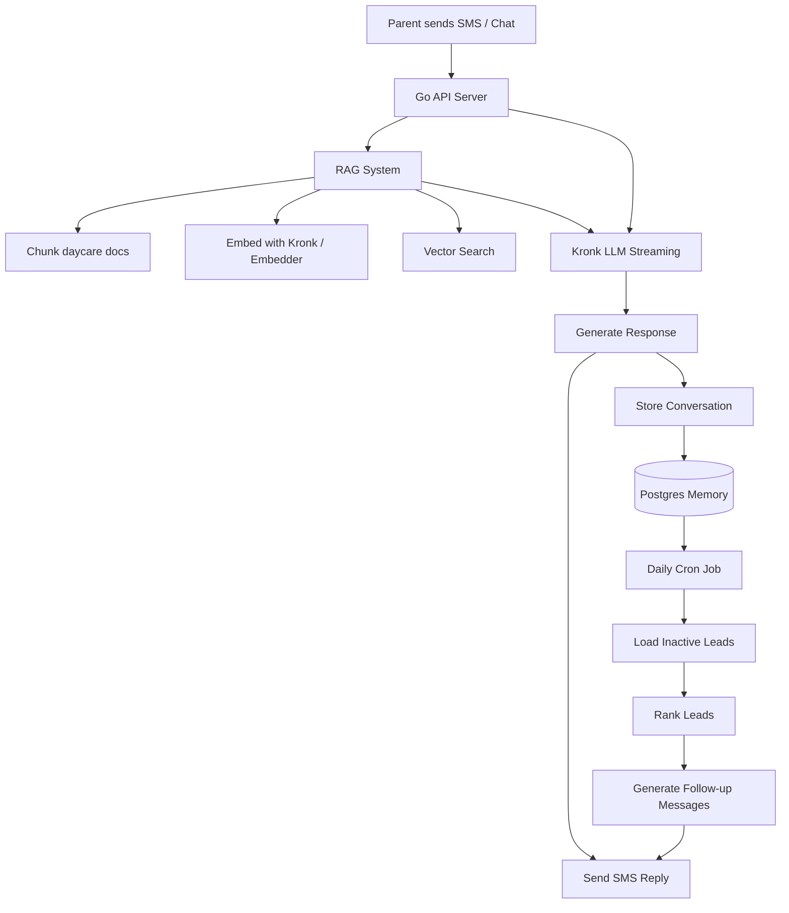

# 📬 Lead Funnel RAG Chat System

A lightweight AI-powered lead management and chat system built in Go using **Kronk**, **RAG (Retrieval-Augmented Generation)**, and streaming LLMs.

This system is designed for a real-world lead funnel workflow where contacts can text a single number, ask questions, and eventually be guided toward the end of the funnel — while the system tracks, ranks, and follows up with leads automatically.

---

# 🧠 Overview

This application combines:

- 📞 SMS/chat interface for inbound parent inquiries  
- 🧾 RAG pipeline over static business knowledge (hours, pricing, policies, etc.)  
- 🧠 LLM reasoning via Kronk for responses and decision-making  
- 🗃️ Postgres memory layer for leads + chat history  
- 🔁 Daily cron system for follow-ups and re-engagement  
- 📊 Lead ranking logic for prioritizing outreach  

---

# 🏗️ Architecture



# ⚙️ Core Components

## 1. RAG System

- Splits static daycare information into structured chunks
- Generates embeddings using:
  - Kronk embedding model (primary)
  - Optional fallback embedder
- Stores vectors for semantic retrieval

### Chunking strategy

- Section-based splitting (`\n\n`)
- Designed for structured business documents:
  - Location
  - Hours
  - Programs
  - Contact info

---

## 2. Embeddings

### 🧪 BasicEmbedder (dev only)

- Hash-based deterministic embeddings
- Used for debugging pipeline integrity

### 🚀 KronkEmbedder (production)

- Uses Kronk embedding API
- Batch embedding support
- Context-aware vector generation

---

## 3. LLM Streaming

Uses Kronk chat streaming API:

- Supports reasoning + content deltas
- Streams tokens in real time
- Separates:
  - Reasoning
  - Answer content

### Key behavior

- Streaming response is assembled incrementally
- Output is logged and optionally persisted

---

## 4. Lead Management System

Stores:

- Contact info
- Conversation history
- Lead status (new / warm / cold / converted)
- Interaction timestamps

Used for:

- Automated follow-ups
- Lead prioritization
- Scheduling tours

---

## 5. Daily Automation (Cron)

A scheduled job runs daily to:

- Pull inactive leads
- Rank leads based on:
  - Last interaction
  - Engagement level
  - Response history
- Trigger follow-up messages via SMS/chat

---

# 🚀 How to Run

## 1. Prerequisites

Make sure you have installed:

- **Go 1.26+** — [Download here](https://golang.org/dl)
- **Docker + Docker Compose** — [Download here](https://www.docker.com/products/docker-desktop)
- **Kronk CLI** — Installed automatically in Docker build

---

## 2. Configure Environment Variables

Create a `.env` file in the `deploy/` directory:

```bash
cp deploy/.env.example deploy/.env
```

Edit `deploy/.env` with your actual values:

```env
# Database
DB_PASSWORD=your_secure_password_here

# Application
ENVIRONMENT=development
LOG_LEVEL=info
PORT=8080
```

---

## 3. Run with Docker

**Start all services:**
```bash
make docker-up
```

This will:
- Build the Docker image
- Start PostgreSQL 18.4
- Run migrations
- Start the API server on `http://localhost:8080`

**View logs:**
```bash
make docker-logs          # API logs
make docker-logs-db       # Database logs
```

**Check status:**
```bash
make docker-ps
```

**Stop services:**
```bash
make docker-down
```

**Clean up everything (including data):**
```bash
make docker-clean
```

---

# 🧠 Next Step

After verification:

1. **Load knowledge documents** — Add `.txt` files to `static/` folder
2. **Test chat endpoint** — Send a message and verify RAG retrieval
3. **Configure Twilio webhooks** — Point to your `/chat` endpoint
4. **Set up cron jobs** — For daily lead follow-ups